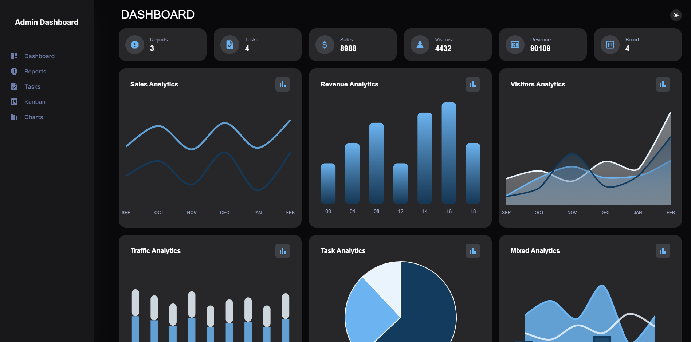
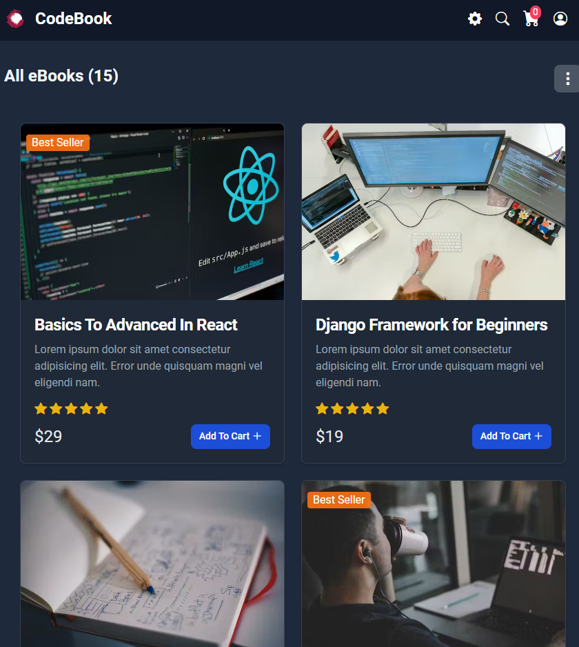
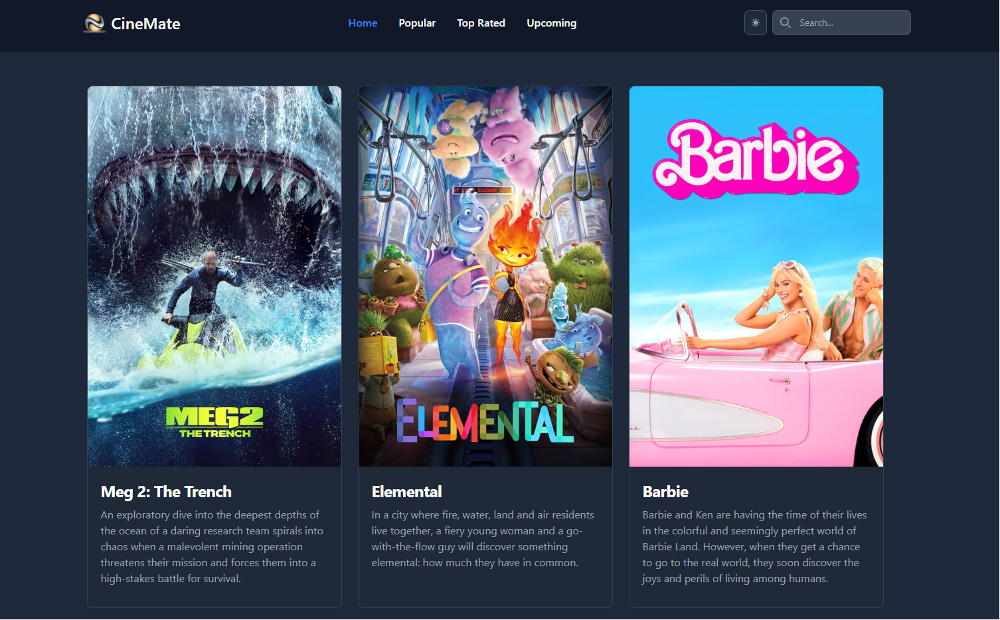
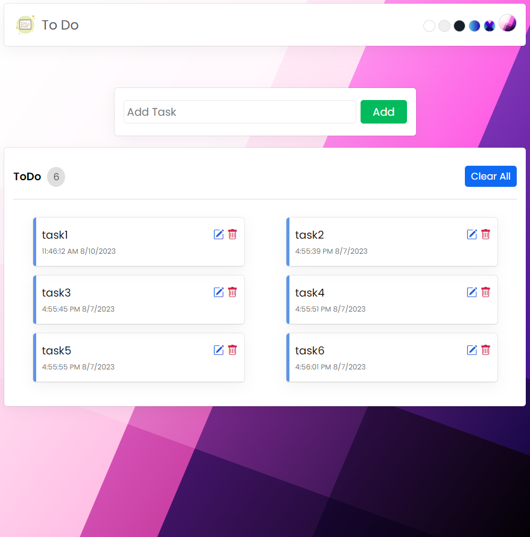

<h1 align="center">
    
</h1>

<h3 align="center">A passionate software developer based in California</h3>

 

 🔭 I’m currently working on **a chat app**
 
 🌱 I’m currently learning **NextJS, Tailwind, React Native**

 💬 Ask me about **Node.js, React, Python, MongoDB... or anything [here](https://github.com/sawaby/sawaby/issues)**

 
  
  
  <a href="https://mnaz-portfolio.netlify.app/" target="_blank">
      <!-- sqlite, safari, google-chrome are other good icon options -->
  </a>

 

 
<h2 align="center">:book: Languages-Frameworks-Tools :clipboard:</h2>
 

    
     

 

  <h2>:game_die: My Contributions :game_die:</h2>
   
  
  
     

 

<h2 align="center">:woman_technologist: Recent Projects :woman_technologist:</h2>

   <kdb>
         
    </kdb>
    &nbsp;&nbsp;&nbsp;&nbsp;
     <kdb> 
         
    </kdb>
     
     
    <kdb> 
        
    </kdb>
    &nbsp;&nbsp;&nbsp;&nbsp;
    <kdb> 
        
    </kdb>

<h2 align="center">:star: Stats :star:</h2>
 

  

  

 
  

  

<h3 align="center">
    
</h3>

 
